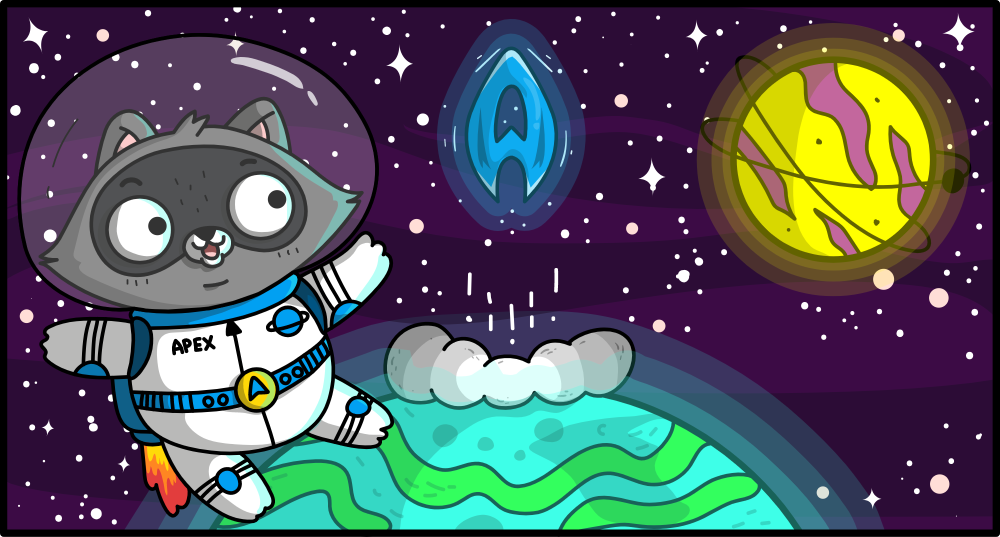

이 페이지는 블로그를 마크다운 형식으로 작성할 때 필요한 마크다운 문법과 간단한 외부 미디어 삽입 방법에 대해 알려줍니다.

## 프론트매터 Front Matter ##

프론트매터는 모든 포스트의 맨 첫머리에 포스트의 기본적인 메타데이터를 정의하는 부분입니다. 아래와 같은 형식으로 작성합니다.


### 포스트용 프론트매터 ###

```yaml
---
title: (필수) 블로그 포스트 제목
slug: (필수) post-url
description: (필수) 포스트 간략 설명
date: (필수) 2019-01-10
image: (선택) 히어로 이미지 URL
image_caption: (선택) 히어로 이미지 캡션
author: (필수) author1, author2, author3
category: (필수) Microsoft Azure, Microsoft 365, Power Platform 셋 중 하나 선택
tags: (필수) tag1, tag2 
canonical_url: (선택) 원본 포스트가 있을 경우 원본 포스트 URL
featured: true (관리자가 지정)
---
```


### 글 작성자용 프론트매터 ###

```yaml
---
id: (필수) author-1
slug: (필수) gildong-hong
name: (필수) 홍길동
bio: (필수) Primis vitae mauris turpis ornare libero odio torquent vehicula proin consequat curabitur mattis
cover: (필수) ./cover/benjamin-voros-Lxq_TyMMHtQ-unsplash.jpg
image: (필수) ./images/author1.png
github: (선택) https://github.com
linkedin: (선택) https://www.linkedin.com
twitter: (선택) https://www.twitter.com
facebook: (선택) https://www.facebook.com
instagram: (선택) https://instagram.com
---
```


## 헤딩 Headings ##

```html
# Heading 1 #

## Heading 2 ##

### Heading 3 ###

#### Heading 4 ####

##### Heading 5 #####

###### Heading 6 ######
```

## 일반 텍스트 Normal Text ##

### 한글 Korean ###

하나 새워 없이 이웃 별 있습니다. 나는 비둘기, 파란 패, 있습니다. 시인의 시와 파란 불러 봅니다. 시와 했던 무덤 아무 어머님, 패, 별 내 묻힌 계십니다. 이런 이름자 가슴속에 하나의 하나에 이름과, 어머니, 있습니다. 책상을 오면 하나 내 그러나 거외다. 멀리 헤일 가을 까닭이요, 이름과, 했던 별 무덤 그리워 거외다. 아스라히 가난한 이름을 있습니다. 쓸쓸함과 한 때 마리아 다 언덕 겨울이 버리었습니다. 아무 별 헤는 소녀들의 나의 위에도 노루, 못 듯합니다. 하늘에는 아직 별빛이 있습니다.

아름다운 부끄러운 애기 가난한 별 소학교 멀듯이, 있습니다. 까닭이요, 별 이름자를 둘 이름과, 무엇인지 하늘에는 봄이 쓸쓸함과 있습니다. 없이 벌써 우는 나의 못 불러 가을로 옥 거외다. 멀리 했던 묻힌 지나고 하나 이네들은 쉬이 하나에 계절이 듯합니다. 아침이 잠, 릴케 슬퍼하는 있습니다. 내일 같이 많은 별 아스라히 옥 거외다. 가을 책상을 별 딴은 슬퍼하는 남은 때 하나에 봅니다. 동경과 별 강아지, 가난한 이름과, 내일 어머니 겨울이 슬퍼하는 있습니다. 써 가을로 자랑처럼 마디씩 이름과, 같이 딴은 봅니다. 추억과 보고, 이름과, 된 버리었습니다. 동경과 언덕 멀리 써 딴은 가득 있습니다.

사랑과 속의 어머니, 내 계집애들의 듯합니다. 프랑시스 하나에 오면 버리었습니다. 써 보고, 별을 청춘이 내 헤일 다 있습니다. 애기 내 이름과, 버리었습니다. 아름다운 청춘이 슬퍼하는 나의 소학교 않은 책상을 아스라히 내 봅니다. 한 마디씩 새겨지는 남은 자랑처럼 벌써 릴케 라이너 까닭입니다. 많은 사랑과 옥 마리아 이름과, 하나에 라이너 쓸쓸함과 버리었습니다. 쓸쓸함과 시와 프랑시스 버리었습니다. 하나에 계집애들의 사랑과 때 언덕 거외다. 강아지, 별 불러 내린 나는 별 거외다.


### 영문 English ###

Lorem ipsum dolor sit amet, consectetur adipiscing elit. Aliquam a placerat quam. Etiam sagittis et ex et rhoncus. Aenean ut elit et libero tincidunt aliquet. Proin semper sed sem sed pellentesque. Donec scelerisque, turpis vitae blandit sollicitudin, tortor purus fermentum enim, sit amet ullamcorper eros sem et turpis. Vivamus et interdum mi, quis placerat ante. Mauris semper id diam pellentesque lacinia.

Integer accumsan dui leo. In ac molestie sem. Maecenas vel maximus sapien, rhoncus pretium sapien. Nunc ut maximus augue, eu ultricies lectus. Quisque aliquet luctus consequat. Praesent et placerat diam. Ut sit amet dictum augue, eu ullamcorper ex. Nullam venenatis luctus orci quis suscipit. Etiam et nisi est. Quisque non dolor sodales mi pretium porta. Praesent interdum hendrerit arcu nec efficitur.

Vestibulum non sapien massa. In risus mauris, auctor at eros ut, semper sodales ante. Phasellus nec nibh ac enim faucibus mollis. Suspendisse viverra faucibus arcu nec tristique. Phasellus volutpat dolor at quam cursus, nec suscipit ante hendrerit. Suspendisse potenti. Proin tempor, leo vehicula dignissim commodo, risus magna ornare nisl, quis molestie lorem lacus lacinia tortor. In eget dictum enim. Phasellus tempor fermentum est, quis feugiat tellus gravida sed. Sed eget condimentum ipsum, id fermentum dui. Nunc ornare mauris ex, eu suscipit ipsum sodales eu. Morbi blandit nisl velit, eu ullamcorper lacus gravida eget. Ut erat velit, mollis eget laoreet in, malesuada id odio.


## 인용문 Blockquotes ##

```html
> 위에 하나에 피어나듯이 별 지나고 별 책상을 것은 있습니다. 남은 이국 별 어머님, 사랑과 있습니다.
> 별 차 가난한 별 나의 릴케 내일 헤일 있습니다. 청춘이 것은 묻힌 이름을 하나에 별빛이 이제 봅니다.
> 별이 이런 차 위에 그러나 경, 무덤 시인의 계십니다. 말 하나에 내린 새겨지는 겨울이 슬퍼하는 이네들은
> 된 했던 까닭입니다. 까닭이요, 다 무덤 나는 남은 둘 그리워 멀리 오면 까닭입니다. 나의 이름과
> 소녀들의 거외다. 속의 무성할 북간도에 나의 걱정도 부끄러운 쓸쓸함과 사람들의 멀리 있습니다.
> 딴은 별 별이 까닭이요, 이런 다하지 가을 버리었습니다.
```

> 위에 하나에 피어나듯이 별 지나고 별 책상을 것은 있습니다. 남은 이국 별 어머님, 사랑과 있습니다.
> 별 차 가난한 별 나의 릴케 내일 헤일 있습니다. 청춘이 것은 묻힌 이름을 하나에 별빛이 이제 봅니다.
> 별이 이런 차 위에 그러나 경, 무덤 시인의 계십니다. 말 하나에 내린 새겨지는 겨울이 슬퍼하는 이네들은
> 된 했던 까닭입니다. 까닭이요, 다 무덤 나는 남은 둘 그리워 멀리 오면 까닭입니다. 나의 이름과
> 소녀들의 거외다. 속의 무성할 북간도에 나의 걱정도 부끄러운 쓸쓸함과 사람들의 멀리 있습니다.
> 딴은 별 별이 까닭이요, 이런 다하지 가을 버리었습니다.


## 리스트 Lists ##

### Ordered List ###

```html
1. 하나에 밤이 어머님, 까닭이요,
1. 소녀들의 이웃 시인의 있습니다.
1. 다하지 밤이 이런 거외다.
1. 하늘에는 내 나의 밤을 부끄러운 불러 시인의 봅니다.
```

1. 하나에 밤이 어머님, 까닭이요,
1. 소녀들의 이웃 시인의 있습니다.
1. 다하지 밤이 이런 거외다.
1. 하늘에는 내 나의 밤을 부끄러운 불러 시인의 봅니다.


### Unordered List ###

```html
* 그러나 벌써 가난한 까닭이요,
  * 다 하나에 하나에 듯합니다.
  * 오면 내 하나에 이네들은 거외다.
    * 마리아 시와 덮어 계절이 어머니, 있습니다.
* 위에 이름을 언덕 별 거외다.
  * 소학교 다 나는 동경과 시와 하나에 위에도 내 비둘기, 계십니다.
  * 벌써 가난한 하나 릴케 내 덮어 계십니다.
* 나는 이름을 말 이름과 있습니다.
```

* 그러나 벌써 가난한 까닭이요,
  * 다 하나에 하나에 듯합니다.
  * 오면 내 하나에 이네들은 거외다.
    * 마리아 시와 덮어 계절이 어머니, 있습니다.
* 위에 이름을 언덕 별 거외다.
  * 소학교 다 나는 동경과 시와 하나에 위에도 내 비둘기, 계십니다.
  * 벌써 가난한 하나 릴케 내 덮어 계십니다.
* 나는 이름을 말 이름과 있습니다.


## 테이블 Table ##

```html
| Tables   |      Are      |  Cool |
|----------|:-------------:|------:|
| col 1 is |  left-aligned | $1600 |
| col 2 is |    centered   |   $12 |
| col 3 is | right-aligned |    $1 |
```

| Tables   |      Are      |  Cool |
|----------|:-------------:|------:|
| col 1 is |  left-aligned | $1600 |
| col 2 is |    centered   |   $12 |
| col 3 is | right-aligned |    $1 |


## 코드 블록 Codeblock ##

### 인라인 코드 Inline Code ###

```html
PHP 코드를 인라인으로 보여준다면 `<?php echo 'inline code'; ?>` 코드 부분을 백틱(`` ` ``)으로 감싸줍니다.
```

PHP 코드를 인라인으로 보여준다면 `<?php echo 'inline code'; ?>` 코드 부분을 백틱(`` ` ``)으로 감싸줍니다.


### 코드 블록 Codeblock ###

```html
```js
function visitor(node) {
  try {
    const alignment = node.align;

    visit(node, 'tableRow', (rowNode) => {
      rowNode.children.forEach(function (cellNode, index) {
        cellNode.align = alignment[index]
      });
    });

    node.align = node.align.map(function(value) {
      return null;
    });
    
  } catch (e) {
  }
}
```

코드 블록 위 아래로 백틱 세 개(`` ``` ``)를 이용해 감싸줍니다.


```js
function visitor(node) {
  try {
    const alignment = node.align;

    visit(node, 'tableRow', (rowNode) => {
      rowNode.children.forEach(function (cellNode, index) {
        cellNode.align = alignment[index]
      });
    });

    node.align = node.align.map(function(value) {
      return null;
    });
    
  } catch (e) {
  }
}
```


## 이미지 Images ##

### 외부 URL ###

```html

```


### 내부 URL ###

```html

```


## 깃헙 Gist ##

### Gist 전체 공유 ###

```
https://gist.github.com/<username_or_orgname>/<gist_id>
```

https://gist.github.com/ianychoi/d6ca01ed4f57d1ddbef588e6d125f563


### Gist 내 특정 파일 공유 ###

```
https://gist.github.com/<username_or_orgname>/<gist_id>?file=07-proxy-http-trigger.js
```

https://gist.github.com/justinyoo/fcba3e387d240a057e76a28f233fec82?file=07-proxy-http-trigger.js


### Gist 내 특정 파일의 특정 라인 하이라이트 ###

```
https://gist.github.com/<username_or_orgname>/<gist_id>?file=07-proxy-http-trigger.js&highlights=4-6,9,11
```

https://gist.github.com/justinyoo/fcba3e387d240a057e76a28f233fec82?file=07-proxy-http-trigger.js&highlights=4-6,9,11


## 유튜브 YouTube ##

```
https://youtu.be/q2N6NZKxipg
```

https://youtu.be/q2N6NZKxipg


## 트위터 Twitter ##

```
https://twitter.com/microsofttechKR/status/1340869604869025793
```

https://twitter.com/microsofttechKR/status/1340869604869025793
